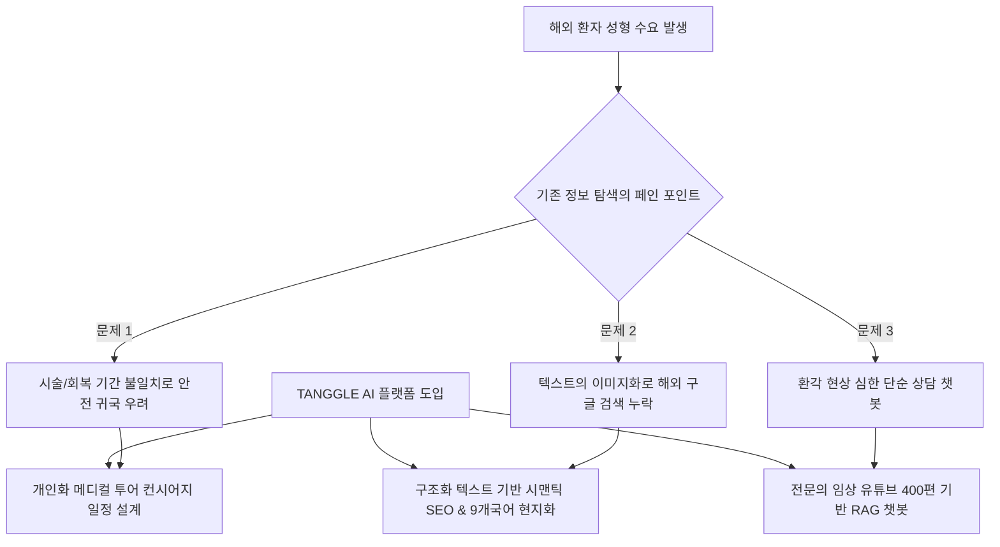
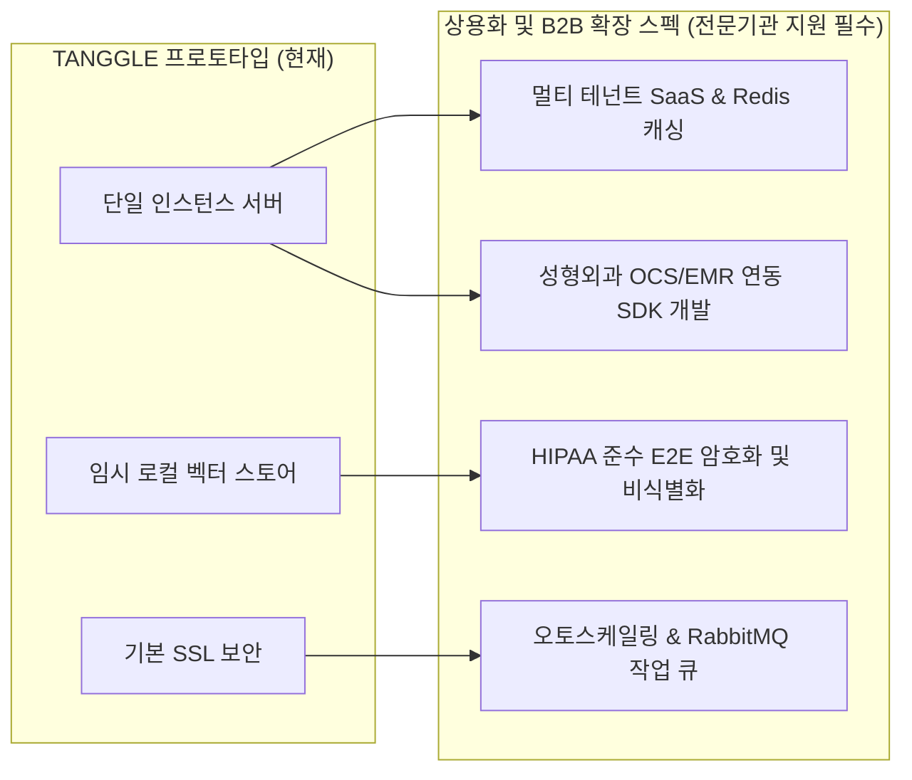

# TANGGLE (팅글) 데모 분석 및 비즈니스 모델 상세 명세서

본 문서는 **TANGGLE (팅글)** 서비스의 실증 페이지(Aura Clinic 데모 웹페이지) 분석 내용에 사용자의 핵심 비즈니스 아이디어 및 이전에 진행된 실제 기술 구현 성과를 결합하여 구체화한 공식 상세 명세서입니다. 

정부지원사업(혁신 소상공인 AI 활용지원 사업)의 **[서식 2] 사업계획서** 작성을 위한 기술 및 비즈니스 기초 설계서로 활용됩니다.

---

## 1. TANGGLE 비즈니스의 시장성 및 차별성

### 1.1 K-성형 의료관광의 글로벌 기회 및 페인 포인트
1. **대한민국 성형 기술의 독보적 입지**: 한국의 성형외과 기술력은 세계 최고 수준으로, 해외 환자들이 약 1달간의 국내 체류 기간을 확보하고 성형 관광을 오는 대규모 고부가가치 수요가 존재합니다.
2. **시술 시간 및 회복 기간 정보의 불일치**: 해외 고객들의 가장 큰 걱정은 **"체류 기간(예: 30일) 내에 시술과 회복이 완전히 끝나 안전하게 귀국할 수 있는가"**입니다. 그러나 기존 병원 사이트나 일반 상담 채널에서는 이에 대한 개인 맞춤형 명확한 정보를 사전에 얻기 어렵습니다.
3. **TANGGLE의 핵심 솔루션**: 환자의 여행 일정, 예산, 희망 부위를 입력받아 여행 기간 내에 회복이 가능한 최적의 메디컬 시술 포트폴리오를 제공하고, VIP 럭셔리 카드를 통해 대기 시간과 회복 가이드를 시각적으로 매핑합니다.

### 1.2 기존 병원 웹사이트의 한계 및 SEO(검색 최적화) 부재 극복
* **텍스트의 이미지화 트렌드**: 국내 대부분의 성형외과 홈페이지는 시각적 화려함만을 강조하여 모든 텍스트 콘텐츠를 통째로 이미지 파일(JPG, PNG)로 제작합니다.
* **구글 검색 유입 불가**: 텍스트가 검색 엔진봇에 수집되지 않기 때문에 구글(Google) 등 글로벌 포털에서 키워드로 검색이 불가능(SEO 지수 최악)하며, 해외 환자의 직접적인 웹 유입이 차단되어 있습니다.
* **TANGGLE의 해결책**:
  * 비전 AI 기반으로 기존 홈페이지의 이미지 정보를 전면 텍스트 디지털화(Reverse Engineering)하여 구조화된 데이터베이스를 사전 확보했습니다.
  * 검색봇이 모든 텍스트를 인덱싱할 수 있는 **완벽한 시맨틱 구조의 SEO 웹 프레임워크**를 기본 탑재합니다.
  * **9개 국어(한국어, 영어, 중국어, 베트남어, 러시아어, 스페인어, 일본어, 아랍어, 태국어)로의 자동 번역 및 현지화 서비스**를 지원하며, 다국어 드롭다운 스위처 컴포넌트를 통해 해외 거점 유입 경로를 극대화합니다.

### 1.3 AI 지식 학습 및 개인 맞춤형 시뮬레이션 기술 (핵심 자산)
1. **신뢰할 수 있는 전문의 임상 지식 RAG**: 
   * 환각율(Hallucination)을 최소화하고 정밀한 가이드를 제공하기 위해, **국내 성형외과 전문의들의 유튜브 강연 및 시술 설명 영상 약 400편의 음성/자막 텍스트 데이터를 AI에게 전량 임베딩 학습**시켰습니다.
2. **개인 안면 사진 기반 시뮬레이터 및 맞춤형 컨설팅**:
   * 환자가 자신의 얼굴 사진을 업로드하면 AI가 해당 시술 후 예상 결과를 2D/3D 이미지로 가공해 줌으로써 잠재 환자의 호기심과 방문 욕구를 강력히 끌어들입니다.
   * 단순 이미지 변화에 그치지 않고, **예상 시술 범위, 부작용 가능성, 대략적 비용, 그리고 실제 시술 시간 및 개인 맞춤형 회복 기간 정보**를 데이터 기반으로 정확하게 산출하여 제공합니다.

### 1.4 고부가가치 B2B SaaS 비즈니스 모델 및 수익성
* **개발 부가가치의 극대화**: TANGGLE은 단순 소개형 웹사이트와 달리 고도의 이미지 처리 AI와 지식 임베딩 DB가 결합한 지능형 SaaS 솔루션입니다. 
* **구축 단가 및 고수익 구조**: 일반 웹사이트 제작 비용 대비 **3배에서 최대 10배에 이르는 고부가가치 개발 비용**을 형성합니다.
* **유지보수 및 인프라 매니지먼트**: 시뮬레이션 서버 유지관리, 다국어 챗봇 토큰 관리, 최신 학회/전문의 강연 지식 업데이트 등의 명목으로 월간/연간 구독 형태의 안정적인 고수익 유지관리 모델을 보장합니다.

---

## 2. TANGGLE 데모 웹페이지 구성 및 UI/UX 분석

* **웹페이지 타이틀**: `Aura Clinic | 이수현 대표원장 책임진료` (하이엔드 리브랜딩)
* **네비게이션 구조**: 시술소개, AI뷰티프리뷰, 의료진소개, 리얼후기, 커뮤니티, 의원소개
* **다국어 상담실장 (RAG 챗봇)**:
  * 🇰🇷 한국어, 🇺🇸 영어, 🇨🇳 중국어, 🇻🇳 베트남어, 🇷🇺 러시아어, 🇪🇸 스페인어, 🇯🇵 일본어, 🇸🇦 아랍어, 🇹🇭 태국어 등 9개국어 지원.
  * 전문의 유튜브 강연 400편에서 가공된 '5W1H Data CUBE'에 기초하여 정밀 답변 추론.
* **시술 카테고리 구성**: 
  * 가슴거상, 동안성형, 바디필러, 복부거상, 얼굴거상, 엉덩이성형, 남성여유증, 이마거상, 지방흡입, 팔거상, 허벅지거상 등 바디 및 안면 성형/거상술 특화.

### 2.1 실제 구현 완료된 주요 기술 스펙

| 구분 | 주요 기술 명세 | 구현 세부 사항 |
| :--- | :--- | :--- |
| **3D 시뮬레이터** | **Three.js & React Three Fiber** | 10.7MB 규모의 리얼 고해상도 여성 인체 모델(`human.glb`)을 탑재하고, 사이버 글래스모피즘 질감의 `MeshPhysicalMaterial`(투명도 0.9, 금속성 0.4)을 적용하여 의료용 스캐너 느낌의 프리미엄 UX 구현. 안면 및 바디 시술 10개 핵심 부위의 3D 좌표를 핫스팟 노드로 매핑하여 클릭 시 RAG 정보 패널을 활성화함. |
| **AI 가상 성형** | **Gemini 3.1 & CSS Clip-path** | 사용자가 스마트폰 셀카를 업로드하면 `gemini-3.1-flash-image-preview` 생성 모델을 거쳐 시뮬레이션 이미지를 로드. 3:5 세로 비율로 마스크 영역을 고정하고, `CSS clip-path`와 터치 및 드래그 이벤트를 바인딩하여 찌그러짐이 전혀 없는 Before/After 분할 슬라이더 구현. |
| **RAG 챗봇** | **하이브리드 RAG & YoutubeCard** | JSON 형태의 시술 정보 데이터베이스와 유튜브 영상 자막 스크립트를 다차원으로 탐색. 답변 내 `[YOUTUBE:영상ID]` 정규식 매칭을 통해 로딩 속도를 최적화한 HQ 썸네일 카드를 생성하며, 클릭 시 유튜브 `<iframe>` 자동재생 플레이어로 전환하는 프리미엄 미디어 통합 구현. |
| **인앱 브라우저 대응** | **UserAgent 하이재킹 이중 차단** | 카카오톡, 인스타 등의 인앱 브라우저를 통한 유입 시 구글 로그인 차단 오류(`403 disallowed_useragent`)를 극복하기 위해 `navigator.userAgent` 분석. **안드로이드**는 외부 크롬 브라우저 강제 호출 스킴 실행, **iOS**는 화면 터치를 막고 외부 사파리 유도 풀스크린 레이아웃 및 원터치 주소 복사 제공. |
| **기하학적 조작 배너** | **브라우저 네이티브 윤곽 보정** | 시스템 리소스 최적화 및 시뮬레이터 도달 전 고객 유치를 위해, Before 이미지 DOM에 브라우저 단에서 강제로 `transform: scale(1.04) scaleX(1.08)`를 실행해 골격을 팽창시키고, 슬라이더 드래그 시 원본으로 슬리밍 복원 및 흑백 필터 톤 조절을 조합해 드라마틱한 턱선/바디 V라인 성형 착시 효과를 네이티브로 구현. |

---

## 3. 기술 구현을 위한 전문기관 기술 지원 요구사항

TANGGLE은 현재 기획자 및 1인 개발 수준의 기술(자동화 및 간이 코드 생성 기술)로 프로토타입이 구현되어 있어, 대규모 상용화 서비스 및 B2B 판매를 위해서는 **전문 멘토기관의 기술적 보완과 자금 지원이 절대적으로 필수적**입니다.

### 3.1 대형 B2B SaaS 성장을 위한 서버 및 데이터베이스(백엔드) 보완
* **현재 상태**: 프로토타입 수준의 단일 인스턴스 서버와 임시 벡터 스토어(Vector Store)를 사용하고 있어, 데이터 크기와 사용자 급증 시 지연 시간(Latency)이 기하급수적으로 늘어남.
* **기술 지원 필요**:
  * 다수의 병원(고객사)이 각각 자신의 로고와 설정을 커스텀하여 도메인을 물려 쓸 수 있는 **멀티 테넌트(Multi-tenant) 아키텍처** 설계.
  * 대용량 이미지 렌더링 파이프라인 및 RAG 벡터 DB의 효율적 조회를 위한 캐싱 인프라(예: Redis) 및 분산 DB 샤딩 기술 도입 지원.

### 3.2 개인 정보 및 의료 보안 체계(Security) 확립
* **현재 상태**: 사용자가 업로드하는 원본 안면 사진 및 상담 내역(의료 개인정보)을 안전하게 규제에 맞춰 보호하는 보안 조치가 미흡함.
* **기술 지원 필요**:
  * HIPAA(미국 의료정보보호법) 수준에 준하는 **상담 데이터 및 안면 이미지 전송/보관 시 종단간 암호화(End-to-End Encryption)** 기법 적용.
  * 민감정보(얼굴 이미지 등)의 서버 임시 저장 후 즉시 파기 파이프라인의 안전성 검증 및 백엔드 암호화 키 관리 모듈 설계.
  * 시뮬레이션 및 데이터 서버 내부망 구축, SSL/TLS 인증 고도화 및 민감정보 자동 마스킹 필터링 기술 적용.

### 3.3 대규모 동시 접속자 처리를 위한 동시성 제어 및 오토스케일링
* **현재 상태**: 해외 동시 접속자가 한꺼번에 유입될 시 GPU 렌더링 서버 및 LLM API 서버가 다운되거나 한계 초과 에러를 뱉는 취약점이 있음.
* **기술 지원 필요**:
  * 트래픽 변화에 맞춰 자동으로 연산 자원을 늘려주는 클라우드 기반 **오토스케일링(Auto-scaling)** 및 로드 밸런서 설정.
  * 비동기 작업 큐(Message Queue, 예: RabbitMQ, AWS SQS)를 이용한 이미지 시뮬레이션 작업 대기열 안정화 기술 이식.

### 3.4 레거시 시스템 및 서드파티 데이터 연동 (호환성)
* **현재 상태**: 독립적인 웹페이지 안에서만 작동하여, 실제 병원들이 사용 중인 기존 관리 툴과 유기적으로 이어지지 않음.
* **기술 지원 필요**:
  * 상담 내역이나 예약 요청을 카카오톡 비즈니스 채널, 알림톡 API 등과 연동하는 실시간 커넥터 개발.
  * 기존 성형외과들이 이미 사용하고 있는 홈페이지(워드프레스, 아임웹 등)에 위젯 형태로 손쉽게 삽입할 수 있는 **임베디드 스크립트(SDK)** 기술 및 내부 병원 예약 관리 시스템과의 데이터 호환 브릿지 구축.
